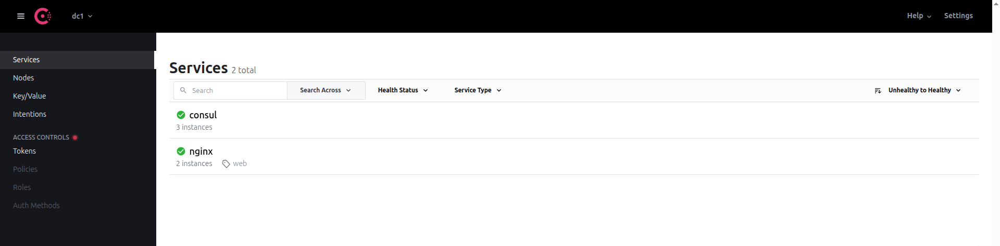
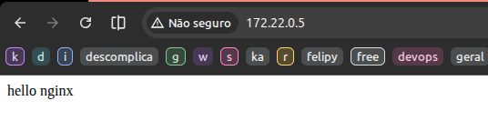

# Service Discovery



*Exemplo de arquitetura Consul Service Discovery*



*Exemplo de registro do NGINX usando Consul*

---


### O que é Service Discovery

Service Discovery (descoberta de serviços) é o processo que permite que serviços dentro de uma infraestrutura distribuída encontrem e se comuniquem uns com os outros automaticamente.

Em sistemas modernos (como microsserviços), novas máquinas e containers são criados e destruídos frequentemente. Além disso, o tráfego é muitas vezes distribuído via **load balancers**.

Sem um mecanismo de descoberta, seria inviável saber manualmente:

- Quais serviços estão ativos.
- Em quais endereços ou portas eles estão disponíveis.
- Para onde enviar o tráfego de rede corretamente.
	- Tráfego é o fluxo de dados ou requisições transmitidas entre computadores ou serviços em uma rede.

O **Service Discovery** resolve esse problema mantendo um **registro centralizado de serviços ativos** e atualizando automaticamente quando ocorrem mudanças (como criação, remoção ou falha de instâncias).

#### Principais Funções

1. **Descoberta de instâncias disponíveis**
	- Permite que um serviço descubra automaticamente **quais instâncias** estão disponíveis para receber requisições.
	- Exemplo: Existem 10 instâncias de **App B**, mas apenas 8 estão **saudáveis**. O Service Discovery só retorna essas 8.
2. **Segmentação e Políticas de Acesso**
	- Define **quem pode acessar quem**, de acordo com políticas e regras de segurança.
	- Evita alterações manuais complexas em firewalls.
	- No Consul, o 2 aparece como Service Segmentation e políticas ACL (Access Control List), configuradas via regras explícitas. O 5 aparece como ACLs propriamente ditas, bloqueando comunicações não autorizadas entre serviços. Ambos usam ACLs, mas a segmentação trata de políticas mais amplas, enquanto o controle de acesso é a aplicação prática dessas regras.
3. **Resolução via DNS**
	- O cliente usa o **nome do serviço**.
	- O **DNS** resolve esse nome para um **IP válido** entre as instâncias registradas.
4. **Health Check**
	- Verifica a **saúde** das instâncias.
	- Faz **ping** em portas HTTP ou endereços TCP.
	- Remove (ou “desregistra”) instâncias que não respondem.
5. **Controle de Acesso**
	- Garante que somente serviços **autorizados** possam se comunicar.

----

### Service Discovery: Consul

O Consul atua como intermediário entre os serviços de uma aplicação, permitindo que eles se encontrem e se comuniquem sem depender de endereços fixos. Ele é agnóstico a linguagem, sistema operacional ou framework — pode ser usado em praticamente qualquer ambiente.

**Consul** é uma ferramenta criada pela **HashiCorp** que oferece múltiplas funcionalidades para ambientes distribuídos, incluindo:

- **Service Discovery:** permite que os serviços registrem e descubram uns aos outros automaticamente.
- **Health Check:** monitora continuamente o estado dos serviços registrados e remove instâncias que não estão saudáveis.
- **Service Segmentation:** oferece controle de acesso e isolamento entre serviços.
- **Load Balancer na Borda (Layer 7):** fornece balanceamento de carga inteligente entre instâncias de serviços.
- **Armazenamento Key/Value:** permite armazenar e gerenciar configurações e segredos, como variáveis de ambiente (ex: credenciais de banco de dados, chaves de API). Pode ser usado para injeção de variáveis durante pipelines de CI.
- **Segurança:** suporta **mTLS (Mutual TLS)** para autenticação mútua e **Service Mesh**, funcionando como proxy entre microserviços

No contexto de Service Discovery, o Consul atua como um **catálogo central** de serviços, permitindo que os clientes saibam onde cada serviço está executando e redirecionem o tráfego de forma dinâmica.

#### partes

- **service registry**: É um repositório central onde todos os serviços de uma aplicação distribuída estão registrados.
- **consul - dns server**:
	- DNS (Domain Name System) é o sistema que traduz nomes de domínios (como google.com) para endereços IP.
	- dig (Domain Information Groper) é uma ferramenta de linha de comando usada para consultar informações do DNS, como o IP associado a um domínio.
	- O comando dig utiliza o utilitário chamado "groper" (de "domain information groper"), que significa "explorador de informações de domínio". Ele serve para consultar informações de DNS (Domain Name System).
- **Servidor líder**: o Consul Server que gerencia a informação central.
- **consul server**: 
- **consul agent**: - Cada aplicação (App) tem um **Consul Agent** que envia informações sobre si para o **Consul Server**.
- **Health Check**: feito pelo **Consul Agent (sidecar)** diretamente no serviço. O agente comunica o status ao servidor.
- **Gossip Protocol**: protocolo usado entre agentes para informar quem está ativo ou inativo (fofoca entre nodes).
- **consul - api rest**:


#### 1. Agente (Agent)
- É um daemon (processo contínuo) executado em todos os nós do cluster.
- Pode operar em dois modos:
- **Client mode**: registra serviços localmente e encaminha informações para o server.
	- Registra serviços localmente e realiza **health checks**.
	- Encaminha informações de configuração dos serviços para o **server**.
	- Funciona via chamadas **RPC**.
	- Possui arquivo de configuração próprio para registrar serviços no **Consul server**.
- **Server mode**: mantém o estado do cluster e responde a queries.
	- Mantém o **estado do cluster** (serviços, membership).
		- **Membership**: controla quais nós são clients e quais são servers.
		- **Stateless**: não mantém dados persistentes internamente.
		- Registra serviços enviados pelos clients via **gRPC**.
		- Retorna resultados de queries:
		- **DNS**: retorna IPs e máquinas de um serviço específico.
		- **API**: retorna IPs e máquinas de um serviço específico.
	- Comunicação entre **datacenters**: facilita a comunicação entre clusters.
	- **Recomendações**:
		- Rodar no mínimo **3 servers** para garantir resiliência.
		- Um server atua como líder, selecionado aleatoriamente.

#### 2. Datacenters

- Separação lógica de clusters dentro do Consul.
- No site oficial, o Consul define "datacenter" como um cluster lógico isolado de agentes Consul, geralmente dentro da mesma rede física. Cada datacenter é um cluster separado.
- São redes virtuais separadas.
- Facilitam comunicação entre clusters.
- cluster é o conjunto de nós (servers e clients) que trabalham juntos sob o mesmo domínio Consul, compartilham estado via Raft e podem se comunicar de forma encriptada via TLS;
- já Datacenter é uma separação lógica desses clusters, geralmente isolando clusters em diferentes redes físicas — cada datacenter é um cluster separado, podendo haver vários datacenters em uma mesma organização.
- A separação lógica envolve dividir sistemas para organização, gestão ou isolamento prático (ex: clusters distintos em Consul), sem necessariamente haver separação física.

#### 3. Dev Mode

- Simula o server do Consul.
- **Nunca usar em produção**.
- Destinado a testes de features, exemplos ou provas de conceito.
- Roda como servidor, mas:
	- Não escala.
	- Não persiste dados, mantém tudo em memória.

#### fluxo

- **Descoberta de serviços**:
	- A aplicação não precisa conhecer o IP de outro serviço.
	- Ela consulta o Consul Agent local, que atua como intermediário.
	- O Agent resolve o nome lógico do serviço (ex.: pagamento.service.consul) consultando cache ou o Consul Server.
	- Esse nome é resolvido para o IP/porta de uma instância disponível.
	- O Consul também disponibiliza uma API para consulta de serviços registrados.

#### dns

- O Consul Agent local roda na máquina e funciona como um servidor DNS interno.
- Cada servidor ou container roda um Consul Agent local, que registra todos os serviços daquela máquina no Consul. Assim, qualquer serviço pode encontrar outros automaticamente, facilitando auto-descoberta, health checks e balanceamento de carga.

#### criptografia - trabalhando com criptografia 

1. Proteção ao ingressar na rede
2. Criptografia de Membership (Gossip Encryption)
3. Verificando se a comunicação está criptografada
4. Criptografia mTLS (Mutual TLS)
- que problema resolve? Criptografia de Membership (Gossip Encryption)
	- Usar uma chave de criptografia no Consul criptografa o tráfego entre agentes; quem não tem a chave correta pode até entrar na rede via consul join, mas não entenderá o tráfego (pacotes permanecem cifrados).
- colocar a chave de criptografia no:
	- servers/server01/server.json
	- clients/consul01/services.json
- como testar se funcionou?
	- entrar no consul server e monitorar a interface de rede com tcpdump
	```bash
	# 1. Acesse o container:
	docker exec -it consulserver01 sh

	# 2. Instale o utilitário de rede:
	apk add tcpdump

	# 3. Liste as interfaces de rede:
	ifconfig

	# 4. Capture o tráfego da porta 8301 (usada pelo Gossip Protocol):
	tcpdump -i eth0 -an port 8301 -A
	```
- alem de cifrar o tráfego interno entre agentes, posso usar TLS/mTLS que lida com certificados digitais e verificação de identidade
- Ao usar TLS acontecem 3 coisas principais:
	- Autenticação do servidor
		- O cliente verifica se o servidor é quem ele diz ser (certificado + CA).
	- Criptografia da comunicação
		- Depois do “acordo inicial”, tudo que vai e volta fica criptografado.
	- Integridade dos dados
		- Garante que ninguém alterou a mensagem no caminho sem ser detectado.
- diferença entre criptografia/consul/gossip e TLS/mTLS
	- Criptografar (no contexto do Consul/Gossip) usualmente se refere a usar uma chave (ex: "encrypt") para cifrar o tráfego interno entre agentes, protegendo os dados do protocolo Gossip.
	- TLS/mTLS é um protocolo para garantir confidencialidade e autenticidade ponta-a-ponta entre clientes/servidores (ex: APIs, RPC), usando certificados digitais, podendo exigir autenticação mútua.
	- Resumindo: criptografia com chave no Gossip protege comunicação interna do cluster; TLS/mTLS protege conexões externas (HTTP/gRPC APIs) e oferece autenticação adicional.
- qual a diferença do open id connect, oauth para tls/mtls?
	- OpenID Connect e OAuth são protocolos de autenticação e autorização para identidade e acesso em aplicações (ex: login via Google). Já TLS/mTLS são protocolos de segurança usados para criptografar conexões de rede e autenticar servidores (e opcionalmente clientes, no mTLS) usando certificados digitais. Ou seja: OpenID Connect/OAuth = identidade/autorização, TLS/mTLS = criptografia/autenticação na rede.

#### consul ui
- É possível habilitar a UI de duas formas:
	- Via linha de comando
	- Via arquivo de configuração
- Painéis da Consul Manager UI
	- Services → lista e status dos serviços registrados.
	- Nodes → mostra os nós do cluster.
	- Key/Value → armazenamento de variáveis de ambiente e configurações.
	- Intentions → parte do Service Mesh, define quais serviços podem se comunicar entre si.
	- Access Control (ACL) → controle de acesso:
		- Policies: definem o que cada serviço pode fazer.
			- Exemplo: permitir gravação no MySQL e apenas leitura no Redis.

#### dicas para produção

- **Criptografia:** use **encrypt key** para proteger a comunicação entre agentes.
- **Mutual TLS (mTLS):** configure certificados conforme a documentação oficial.
- **Autojoin:** configure o cluster para iniciar automaticamente com **auto-join**.
----

### **Conceitos principais**
- **Raft**: é um protocolo de consenso usado para garantir que todos os servidores tenham o mesmo estado e eleger um líder — é essencial para consistência forte entre servers.
	- garante consenso e liderança
	- Consenso: Acordo coletivo obtido entre múltiplos participantes sobre decisões ou estados comuns.
	- Consistência: Ausência de contradição; elementos ou dados permanecem coerentes entre si.
	- Integridade: Estado de preservação, exatidão e conformidade com regras; ausência de corrupção ou erro.
- **Gossip**: é um protocolo de comunicação rápido, usado para sincronizar informações (como status de nós) entre todos os agentes, mas sem garantir consenso — foca na disseminação eficiente em rede interna.
	- usado para disseminação rápida sem consenso.

---- 

### Comandos para iniciar o ambiente

- instalar o docker

```bash
# como testar rapidamente
docker compose up

# ui
http://localhost:8500/ui

# descobrir ip nginx e pegar address client 
# ex: "Address": "172.22.0.5",
http://localhost:8500/v1/catalog/service/nginx

# acessar no navegador
172.22.0.5

# como acessar o ngix via consul por url no navegador?
No mundo real, aplicações usam Consul para descobrir o IP/porta do serviço (via DNS/API) e acessam o serviço diretamente, ou usam um service mesh/reverse proxy (como Traefik, Envoy ou Consul Connect) para rotear automaticamente usando nomes Consul. O navegador sozinho não resolve nomes Consul nem acessa via Consul.

```


```bash
### DOCKER

	# Subir os containers
	docker compose up -d

	# Acessar o container do agent (exemplo com consul01)
	docker exec -it consul01 sh

### CONSUL

	# os containers para server e client no docker-compose já estão configurados para iniciar automaticamente, eles usam os arquivos de configuração em /clients e /servers

	# rodar em modo dev
	consul agent -dev

	# ver membros do cluster.
	# Mostra todos os nós (server e client).
	consul members

	# consultar: api http rest :8500
	curl localhost:8500/v1/catalog/nodes

	# consultar: dns
		# instalar
		apk -U add bind-tools
		# chamar
		dig @localhost -p 8600
		dig @localhost -p 8600 consul01.node.consul +short

	# Consul: Sincronização de Servidores e Registro de Serviços
		1. Estrutura Docker para Consul
		2. Inicializando Consul Server
		3. Inicializando Consul Client
		4. Registro de Serviços
		5. Health Checks
		6. Modo Automático para Clients
		7. Observações Finais

		# entrar no cluster(unir servidores), conectar client a um server
		consul join XXX.XXX.XXX.XXX

		
		# 2. Inicializando Consul Server
			# Iniciar o agente Consul em modo server:
			consul agent -server \
			-bootstrap-expect=3 \
			-node=consulserver01 \
			-bind=172.20.0.1 \
			-data-dir=/var/lib/consul \
			-config-dir=/etc/consul.d

		# 3. Inicializando Consul Client
			# Inicializar agente client:
			consul agent \
			-bind=172.20.0.4 \
			-data-dir=/var/lib/consul \
			-config-dir=/etc/consul.d

		# 4. Registro de Serviços
			# registro de serviço
				# olhar caderno de anotações novamente
				# colocar informações dentro do config e fazer reload
				# /clients/consul01/services.json
			node_name: Identifica unicamente o agente Consul nesse nó/máquina no cluster. Usado para distinguir clientes/servidores Consul.
			id: Identificador único do serviço registrado (ou health check). Evita duplicidade no catálogo do Consul.
			name: Nome do serviço, usado nas consultas/descoberta (ex: para DNS/API, como `nginx.service.consul`).
			tags: Lista de rótulos para classificar, filtrar ou agrupar serviço (ex: `web` diferencia tipos/funções).

			# Recarregar agente ao atualizar
			consul reload

			# Consultando serviços via DNS
			apk -U add bind-tools    # instalar ferramentas DNS
			dig @localhost -p 8600 nginx.service.consul
			dig @localhost -p 8600 web.nginx.service.consul

			# Consultando serviços via API REST
			curl localhost:8500/v1/catalog/services
			consul catalog nodes --service nginx
			consul catalog nodes --detailed
		
		# 5. Health Checks
			- Serviços indisponíveis são removidos automaticamente do catálogo.
			- Testar health check:
			ps       # localizar processo nginx
			kill XXX # matar processo nginx
			dig @localhost -p 8600 nginx.service.consul
			nginx    # subir novamente
			dig @localhost -p 8600 nginx.service.consul

		# 6. Modo Automático para Clients
		- retry-join permite que o client tente se unir a múltiplos servers para resiliência.

		# 7. Observações Finais
			- Cada serviço Consul (server ou client) deve rodar na mesma máquina que o serviço que ele monitora.
			- `services.json` deve ter IDs únicos.
			- Health checks garantem que apenas serviços ativos aparecem no catálogo.
			- Os metadados do serviço podem ser usados para balanceamento de carga.


```